# Current Dependency Map — M26-A

**Date**: 2026-06-15
**Branch**: `engineering/m26a-program-reset-audit`

## Purpose

This document maps the current-state dependencies within the repository to
identify architecture boundary violations, hardware-coupling paths, and areas
requiring refactoring for multi-platform support.

## Module Dependency Overview

```mermaid
graph TD
    subgraph "Core (calibration_core)"
        CC_INIT[__init__.py]
        CC_CMD[command_adapter.py]
        CC_COMP[compensation_models.py]
        CC_POL[compensation_policies.py]
        CC_VER[compensation_verification.py]
        CC_CON[measurement_contract.py]
        CC_MAP[measurement_contract_mapping.py]
        CC_EXT[measurement_extractor.py]
        CC_MAN[measurement_manifest.py]
        CC_PIPE[measurement_pipeline.py]
        CC_SCH[measurement_schema.py]
        CC_REG[platform_registry.py]
        CC_EXP[profile_exporter.py]
        CC_LOAD[profile_loader.py]
        CC_RESP[response_analyzer.py]
        CC_RISK[risk_classifier.py]
        CC_LOG[state_logger.py]
        CC_TRIAL[trial_scheduler.py]
        CC_VC[velocity_compensation.py]
        CC_RVC[revised_velocity_compensation.py]
    end

    subgraph "K1 Tooling (k1_measurement)"
        K1_CR[command_runner.py]
        K1_FL[field_logging.py]
        K1_FS[field_session.py]
        K1_FTP[field_test_pack.py]
        K1_FRVP[full_range_velocity_profile.py]
        K1_LN[logger_node.py]
        K1_M19[m19_validation_schema.py]
        K1_M25[m25_real_collection_preflight.py]
        K1_MET[metrics.py]
        K1_NRM[navigation_risk_mapping.py]
        K1_PB[profile_builder.py]
        K1_RLN[real_log_normalizer.py]
        K1_RG[report_generator.py]
        K1_RDS[research_dataset_schema.py]
        K1_RPE[research_pipeline_evaluation.py]
        K1_R2V[ros2_readonly_validator.py]
        K1_TM[topic_mapping.py]
        K1_TMAN[trial_manager.py]
        K1_VP[velocity_profile.py]
        K1_VRDB[velocity_response_dataset_builder.py]
        K1_VRM[velocity_response_model.py]
        K1_VIZ[visualization.py]
    end

    subgraph "Platforms"
        PK1[platforms/booster_k1/]
        PG1[platforms/unitree_g1/]
        PGO1[platforms/unitree_go1/]
    end

    subgraph "Scripts (93 files)"
        SCRIPTS[scripts/]
    end

    subgraph "External"
        NUMPY[numpy]
        PANDAS[pandas]
        SCIPY[scipy]
        YAML[pyyaml]
        JSONSCH[jsonschema]
        MPL[matplotlib]
        ROS2[ros2 CLI - optional]
        BOOSTER[booster_robotics_sdk - optional]
    end

    CC_INIT --> CC_CMD
    CC_INIT --> CC_COMP
    CC_INIT --> CC_EXT
    CC_INIT --> CC_MAN
    CC_INIT --> CC_PIPE
    CC_INIT --> CC_SCH
    CC_INIT --> CC_REG
    CC_INIT --> CC_EXP
    CC_INIT --> CC_LOAD
    CC_INIT --> CC_RESP
    CC_INIT --> CC_RISK
    CC_INIT --> CC_LOG
    CC_INIT --> CC_TRIAL
    CC_INIT --> CC_VC

    CC_REG --> PK1
    CC_REG --> PG1
    CC_REG --> PGO1

    CC_LOAD --> PK1

    K1_CR --> CC_CMD
    K1_FRVP --> CC_SCH
    K1_PB --> CC_SCH
    K1_TMAN --> CC_SCH

    SCRIPTS --> CC_INIT
    SCRIPTS --> K1_CR
    SCRIPTS --> K1_FL
    SCRIPTS --> K1_FS
    SCRIPTS --> K1_FRVP

    PK1 --> BOOSTER
    PK1 --> ROS2
```

## K1-Specific Dependency Chains

### Modules that depend on K1-specific concepts

| Module | K1 Dependency | Type |
|---|---|---|
| `calibration_core/compensation_models.py` | `SUPPORTED_EMPIRICAL_PLATFORM = "booster_k1"` | Hardcoded string |
| `calibration_core/profile_loader.py` | `load_k1_gold_profile()` with hardcoded path | Function + path |
| `calibration_core/__init__.py` | Exports `load_k1_gold_profile` | API surface |
| `k1_measurement/command_runner.py` | K1 command sequence, K1 speed limits | Business logic |
| `k1_measurement/full_range_velocity_profile.py` | K1 speed domain `[0.35, 0.60]` | Constants |
| `k1_measurement/m25_real_collection_preflight.py` | K1-specific preflight checks | Business logic |
| `k1_measurement/real_log_normalizer.py` | K1 topic mapping normalization | Data pipeline |
| `k1_measurement/topic_mapping.py` | K1 ROS2 topic mappings | Configuration |
| `platforms/booster_k1/*` | Entire package is K1-specific | Adapter |
| `scripts/send_m23b_k1_velocity_command.py` | K1 velocity command | Execution |
| `scripts/run_m23b_k1_compensation_trials.py` | K1 compensation trials | Execution |

### Generic modules that import hardware-specific modules

| Generic Module | Imports From | Concern |
|---|---|---|
| `calibration_core/platform_registry.py` | `platforms.booster_k1`, `platforms.unitree_g1`, `platforms.unitree_go1` | Acceptable registry pattern; imports are function-scoped |
| `calibration_core/profile_loader.py` | Reads K1 gold profile path | Hardcoded path; should be parameterized |

### Scripts that can cause hardware motion

| Script | Motion Risk | Default Mode | Gate |
|---|---|---|---|
| `scripts/send_m23b_k1_velocity_command.py` | HIGH | Requires flags | Explicit execution flags |
| `scripts/run_m23b_k1_compensation_trials.py` | HIGH | Requires flags | Explicit execution flags |
| `scripts/run_m24b_s2_profile_refresh_trials.py` | HIGH | Requires flags | Explicit execution flags |
| `scripts/run_m24h_controlled_s2_replication_trials.py` | HIGH | Requires flags | Explicit execution flags |
| `scripts/run_booster_k1_measurement.py` | HIGH | Dry-run | `--execute` flag required |

### Authoritative vs. Derived Configurations

| Config | Status | Authoritative For |
|---|---|---|
| `configs/m25_k1_safe_speed_operator_confirmation.yaml` | **Authoritative** | K1 safe speed maximum (0.6 m/s) |
| `configs/m25_k1_s2_real_collection.yaml` | Derived | K1 real collection parameters |
| `configs/m25_full_range_velocity_profile_template.yaml` | **Authoritative** | M25 profile structure |
| `configs/m25_k1_safe_speed_operator_confirmation_template.yaml` | Template | Operator confirmation process |
| `configs/m25_real_collection_preflight_template.yaml` | Template | Preflight checklist |
| `configs/real_k1_field_session_template.yaml` | Template | Field session structure |
| `configs/real_k1_topic_mapping_template.yaml` | Template (TBD) | K1 topic mapping |
| `configs/velocity_response_dataset_schema_v1.json` | **Authoritative** | Research dataset schema |
| `config/experiment_forward_v0.yaml` | Possibly stale | M8 experiment config |

### Generated vs. Source-Controlled Outputs

| Path | Type | Notes |
|---|---|---|
| `outputs/real_k1_validation_m19/k1_gold_profile_v1.json` | **Source-controlled** | Gold reference, must not be regenerated |
| `outputs/compensation_experiments/*` | Generated | Historical experiment results |
| `outputs/research_datasets/*` | Generated | Research pipeline outputs |
| `outputs/full_range_velocity_profile/*` | Generated | M25 pipeline outputs |
| `outputs/measurement_v1/*` | Generated | Measurement contract artifacts |
| `outputs/engineering/*` | Source-controlled | M26-A engineering documents |

### Modules Safe to Import Without Hardware

| Module | Safe? | Notes |
|---|---|---|
| `calibration_core/*` | YES | No hardware imports |
| `k1_measurement/metrics.py` | YES | Pure functions |
| `k1_measurement/visualization.py` | YES | No matplotlib dependency |
| `k1_measurement/trial_manager.py` | YES | Dry-run by default |
| `k1_measurement/profile_builder.py` | YES | Pure computation |
| `k1_measurement/report_generator.py` | YES | Pure computation |
| `k1_measurement/m19_validation_schema.py` | YES | Data models only |
| `k1_measurement/command_runner.py` | YES | Dry-run default |
| `k1_measurement/logger_node.py` | YES | Refuses unsafe setup |
| `k1_measurement/field_logging.py` | Conditional | Requires ROS2 CLI for execution, safe to import |
| `k1_measurement/ros2_readonly_validator.py` | Conditional | Requires ROS2 CLI for execution, safe to import |
| `platforms/unitree_g1/*` | YES | All scaffold, no real imports |
| `platforms/unitree_go1/*` | YES | All scaffold, no real imports |
| `platforms/booster_k1/*` | Conditional | Requires booster_robotics_sdk for execution |

### Likely Dependency Cycles or Boundary Violations

1. **`calibration_core` → `platforms/*`**: The core imports platform adapters via
   `platform_registry.py`. While this is a function-scoped import (acceptable),
   it creates a dependency from "generic core" to "specific platforms."
   **Mitigation**: The registry pattern is intentional; the core should depend on
   abstract interfaces, not concrete adapters.

2. **`calibration_core/profile_loader.py` ↔ K1 gold profile**: The core module
   hardcodes a path to a K1-specific artifact. This couples the generic profile
   loader to K1 deployment details.
   **Fix**: Parameterize profile paths; move K1 convenience to adapter.

3. **`k1_measurement/*` → `calibration_core/*`**: Many K1 tooling modules import
   from calibration_core. This is the expected direction (specific → generic),
   but the imports should be limited to domain interfaces, not implementation details.

4. **Scripts → Everything**: The 93 scripts import from both `calibration_core`
   and `k1_measurement` freely. Many scripts contain milestone-specific logic
   that will need migration as the architecture evolves.
