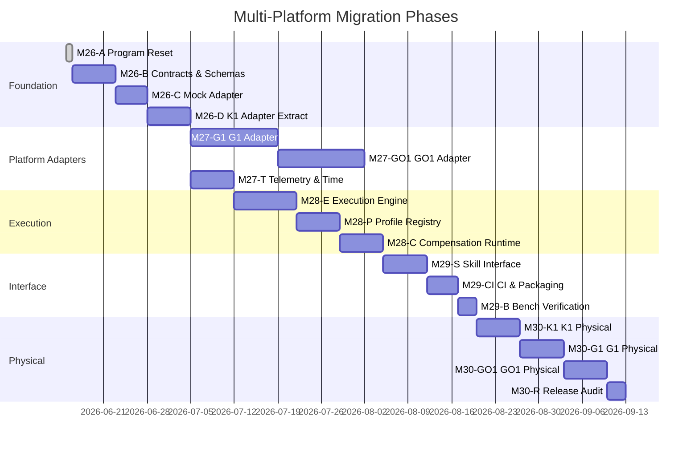

# Multi-Platform Migration Plan — M26-A

**Date**: 2026-06-15
**Status**: Planning (no implementation)
**Prerequisite**: M26-A completion

## Overview

This plan defines the phased migration from the current K1-centric codebase to
the target multi-platform architecture. Each phase has explicit scope, acceptance
criteria, and prohibited work.

## Phase 1: Unified Contracts and Schemas

**Milestone**: M26-B (proposed)
**Prerequisite**: M26-A

### Scope
- Define `domain/` package with platform-independent value objects
- Define `ports/` package with abstract interfaces
- Define `schemas/` package with versioned JSON schemas
- Extract existing schemas and contracts into the new structure

### Files Expected to Change
- New: `calibration_skill/domain/*`
- New: `calibration_skill/ports/*`
- New: `calibration_skill/schemas/*`
- Reference: `calibration_core/measurement_schema.py`, `calibration_core/measurement_contract.py`, `contracts/*`

### Acceptance Criteria
- All domain objects are immutable (`@dataclass(frozen=True)`)
- No vendor SDK imports in domain, ports, or schemas
- All abstract interfaces use `typing.Protocol`
- Existing tests pass with new domain objects
- JSON schemas validate successfully

### Test Level: Unit
### Hardware Requirement: None
### Rollback Strategy: Domain package is new; existing code unchanged
### Prohibited Work
- Do not modify compensation algorithm behavior
- Do not change K1 adapter command sequence
- Do not alter gold profile

---

## Phase 2: Adapter Registry and Mock Adapter

**Milestone**: M26-C (proposed)
**Prerequisite**: Phase 1

### Scope
- Implement `AdapterFactory` registry
- Implement mock adapter implementing all ports interfaces
- Add adapter availability detection (no SDK import required)
- Add capability reporting to mock adapter

### Files Expected to Change
- New: `calibration_skill/adapters/mock/*`
- Modified: `calibration_core/platform_registry.py` → `calibration_skill/ports/adapter_registry.py`
- Modified: Test files to use mock adapter

### Acceptance Criteria
- Mock adapter passes all interface contracts
- Full pipeline runs with mock adapter (no hardware)
- Adapter registry discovers mock adapter without imports
- Tests can swap between mock and real adapters

### Test Level: Unit + Integration
### Hardware Requirement: None
### Rollback Strategy: Mock adapter is new; existing adapters unchanged
### Prohibited Work
- Do not connect to any robot
- Do not import any vendor SDK in mock adapter

---

## Phase 3: K1 Adapter Extraction and Compatibility Hardening

**Milestone**: M26-D (proposed)
**Prerequisite**: Phase 2

### Scope
- Migrate `platforms/booster_k1/` to `calibration_skill/adapters/booster_k1/`
- Ensure K1 adapter implements all ports interfaces
- Remove K1-specific logic from core modules
- Parameterize `load_k1_gold_profile()`
- Add K1-specific safety envelope

### Files Expected to Change
- Moved: `platforms/booster_k1/*` → `calibration_skill/adapters/booster_k1/*`
- Modified: `calibration_core/compensation_models.py` (remove hardcoded platform)
- Modified: `calibration_core/profile_loader.py` (parameterize path)
- Modified: `calibration_core/__init__.py` (remove K1 exports)
- Modified: All files importing from `platforms.booster_k1`

### Acceptance Criteria
- All existing K1 tests pass after migration
- K1 adapter is importable without Booster SDK (graceful degradation)
- No K1-specific strings in core modules
- Gold profile path configurable, not hardcoded

### Test Level: Unit + Integration (K1 hardware optional)
### Hardware Requirement: K1 hardware for full verification (optional for unit tests)
### Rollback Strategy: K1 adapter preserved in old location during migration
### Prohibited Work
- Do not change K1 command sequence
- Do not alter gold profile
- Do not change compensation model behavior

---

## Phase 4: G1 Adapter Implementation

**Milestone**: M27-G1 (proposed)
**Prerequisite**: Phase 3

### Scope
- Research G1 SDK2 API surface
- Implement G1 adapter against ports interfaces
- Add G1-specific telemetry normalization
- Add G1 safety envelope configuration
- Add G1 capability descriptor

### Files Expected to Change
- Modified: `calibration_skill/adapters/unitree_g1/*` (from scaffold to implementation)
- New: G1-specific configs
- New: G1-specific tests

### Acceptance Criteria
- G1 adapter imports unitree_sdk2_python successfully
- G1 adapter passes all interface contract tests
- G1 telemetry normalizes to platform-independent format
- G1 safety envelope is configurable
- Bench verification complete (no physical robot required yet)

### Test Level: Unit + Bench
### Hardware Requirement: None for bench verification; G1 hardware for physical
### Rollback Strategy: G1 adapter is isolated; no impact on K1
### Prohibited Work
- Do not claim G1 physical verification without hardware testing
- Do not send commands to G1 without operator confirmation

---

## Phase 5: GO1 Adapter/Sidecar Implementation

**Milestone**: M27-GO1 (proposed)
**Prerequisite**: Phase 4

### Scope
- Research GO1 legacy SDK and UDP protocol
- Evaluate in-process vs. subprocess isolation
- Implement GO1 adapter against ports interfaces
- Add GO1-specific telemetry normalization
- Add GO1 safety envelope configuration

### Files Expected to Change
- Modified: `calibration_skill/adapters/unitree_go1/*` (from scaffold to implementation)
- New: GO1-specific configs
- Potential: Subprocess worker for GO1 SDK isolation

### Acceptance Criteria
- GO1 adapter imports/communicates with legacy SDK
- GO1 adapter passes all interface contract tests
- If subprocess: round-trip latency < 10ms
- GO1 telemetry normalizes to platform-independent format
- Bench verification complete

### Test Level: Unit + Bench
### Hardware Requirement: None for bench verification; GO1 hardware for physical
### Rollback Strategy: GO1 adapter is isolated; no impact on K1 or G1
### Prohibited Work
- Do not claim GO1 physical verification without hardware testing
- Do not send commands to GO1 without operator confirmation

---

## Phase 6: Unified Telemetry and Time Semantics

**Milestone**: M27-T (proposed)
**Prerequisite**: Phase 3

### Scope
- Implement `MonotonicClock` abstraction
- Ensure all adapters use monotonic time for sequencing
- Normalize telemetry timestamps across platforms
- Add telemetry staleness detection

### Files Expected to Change
- New: `calibration_skill/domain/monotonic_clock.py`
- Modified: All adapter telemetry paths
- Modified: `k1_measurement/ros2_readonly_validator.py`

### Acceptance Criteria
- All timestamps in the system are monotonic
- Telemetry staleness is detected and handled
- Cross-platform telemetry comparison is possible
- Clock is injectable for testing

### Test Level: Unit + Integration
### Hardware Requirement: None
### Rollback Strategy: Incremental; add monotonic clock alongside existing timestamps
### Prohibited Work
- Do not remove existing system-clock timestamps (add monotonic, don't replace yet)

---

## Phase 7: Calibration Execution Engine

**Milestone**: M28-E (proposed)
**Prerequisite**: Phase 6

### Scope
- Implement state machine from end-to-end use chain
- Implement trial scheduling with safety envelope enforcement
- Implement preflight validation
- Implement operator confirmation flow
- Implement command execution with TTL

### Files Expected to Change
- New: `calibration_skill/application/execution_engine.py`
- New: `calibration_skill/runtime/*`
- Modified: `calibration_core/trial_scheduler.py`

### Acceptance Criteria
- State machine enforces all transitions from use chain
- Safety envelope is checked before every command
- Command TTL is enforced
- Operator confirmation gates all motion
- Emergency stop works from any state

### Test Level: Unit + Integration
### Hardware Requirement: Mock adapter sufficient; K1 hardware for full verification
### Rollback Strategy: New engine runs alongside existing scripts
### Prohibited Work
- Do not bypass safety checks in any code path

---

## Phase 8: Model/Profile Registry

**Milestone**: M28-P (proposed)
**Prerequisite**: Phase 7

### Scope
- Implement profile versioning and immutability
- Implement provenance chain verification
- Implement model fitting abstraction
- Implement profile publication workflow

### Files Expected to Change
- New: `calibration_skill/application/profile_registry.py`
- Modified: `calibration_core/profile_exporter.py`
- Modified: `calibration_core/profile_loader.py`

### Acceptance Criteria
- Gold profiles are immutable (write-once)
- Provenance chains are verifiable
- Profile hashing is deterministic
- Model fitting works with mock data

### Test Level: Unit + Integration
### Hardware Requirement: None
### Rollback Strategy: New registry; existing profiles unchanged
### Prohibited Work
- Do not overwrite existing gold profile
- Do not change profile schema without version bump

---

## Phase 9: Bounded Compensation Runtime

**Milestone**: M28-C (proposed)
**Prerequisite**: Phase 8

### Scope
- Implement compensation decision engine
- Implement benefit gate (identity fallback)
- Implement confidence-based gating
- Implement compensation audit trail

### Files Expected to Change
- Modified: `calibration_core/compensation_models.py`
- Modified: `calibration_core/compensation_policies.py`
- Modified: `calibration_core/velocity_compensation.py`

### Acceptance Criteria
- Compensation decisions include full provenance
- Benefit gate prevents harmful compensation
- Confidence below threshold triggers fallback
- Audit trail records all compensation decisions

### Test Level: Unit + Integration
### Hardware Requirement: None
### Rollback Strategy: Compensation logic already isolated; enhance, don't replace
### Prohibited Work
- Do not claim compensation effectiveness without physical validation

---

## Phase 10: Agent Skill Interface

**Milestone**: M29-S (proposed)
**Prerequisite**: Phase 9

### Scope
- Define agent-callable operation envelope (JSON schema)
- Implement skill operations (calibrate, validate, compensate, audit)
- Add input validation and error serialization
- Add deterministic output formatting

### Files Expected to Change
- New: `calibration_skill/skill/*`
- New: `calibration_skill/cli/*`

### Acceptance Criteria
- All skill operations return deterministic JSON
- Invalid inputs produce structured errors
- Agent can invoke calibration pipeline end-to-end
- CLI commands use same application layer as skill interface

### Test Level: Unit + Integration
### Hardware Requirement: Mock adapter sufficient
### Rollback Strategy: New interface; existing scripts unchanged
### Prohibited Work
- Do not expose raw hardware commands through skill interface
- Do not bypass operator confirmation in skill interface

---

## Phase 11: CI and Packaging

**Milestone**: M29-CI (proposed)
**Prerequisite**: Phase 10

### Scope
- Add CI configuration (.github/workflows)
- Add package build configuration
- Add dependency locking
- Add pre-commit hooks

### Files Expected to Change
- New: `.github/workflows/ci.yml`
- Modified: `pyproject.toml`
- New: `.pre-commit-config.yaml`

### Acceptance Criteria
- CI runs unit tests with mock adapter only
- CI validates all JSON schemas
- Package installs without vendor SDKs
- Pre-commit hooks enforce code quality

### Test Level: CI
### Hardware Requirement: None
### Rollback Strategy: New CI; existing workflows unchanged
### Prohibited Work
- Do not run hardware tests in CI
- Do not require vendor SDKs in CI environment

---

## Phase 12: Bench Verification

**Milestone**: M29-B (proposed)
**Prerequisite**: Phase 11

### Scope
- Run full pipeline with mock adapter
- Validate all contracts and schemas
- Verify all ADR requirements are met
- Generate test coverage report

### Acceptance Criteria
- Full pipeline passes with mock adapter
- All schemas validate
- Test coverage > 80%
- No vendor SDK required

### Test Level: Integration
### Hardware Requirement: None
### Rollback Strategy: N/A (verification only)
### Prohibited Work
- Do not claim physical verification

---

## Phase 13-16: Physical Verification

**Milestones**: M30-K1, M30-G1, M30-GO1, M30-R (proposed)

### K1 Physical Verification (M30-K1)
- Execute full calibration session on K1 hardware
- Verify gold profile against fresh measurements
- Verify compensation effectiveness
- **Hardware Requirement**: Booster K1 robot
- **Prohibited**: Do not claim G1/GO1 physical readiness

### G1 Physical Verification (M30-G1)
- Execute full calibration session on G1 hardware
- Build and validate G1 profile
- Verify compensation effectiveness
- **Hardware Requirement**: Unitree G1 robot
- **Prohibited**: Do not claim G1 support before this milestone

### GO1 Physical Verification (M30-GO1)
- Execute full calibration session on GO1 hardware
- Build and validate GO1 profile
- Verify compensation effectiveness
- **Hardware Requirement**: Unitree GO1 robot
- **Prohibited**: Do not claim GO1 support before this milestone

### Release Audit (M30-R)
- Verify all provenance chains
- Audit all safety decisions
- Generate release package
- **Hardware Requirement**: None (all physical verification complete)
- **Prohibited**: Do not release without all physical verifications complete

## Migration Timeline Overview

