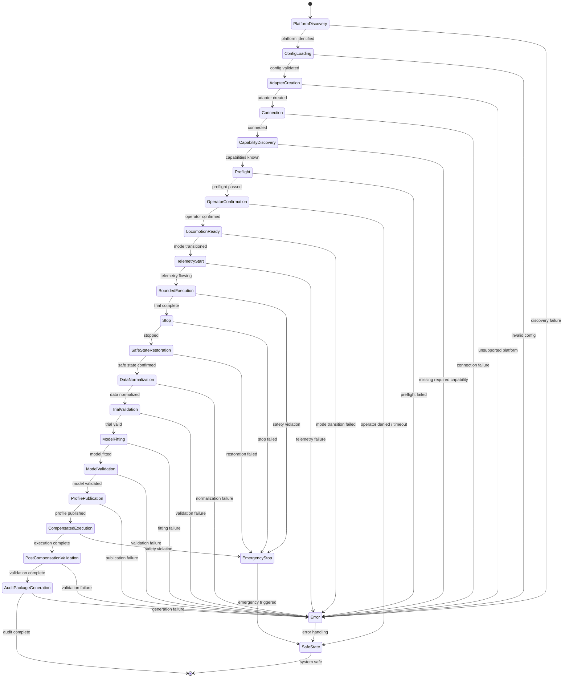

# Target End-to-End Use Chain — M26-A

**Date**: 2026-06-15
**Status**: Proposed (not implemented)

## Platform-Neutral State Machine

The following state machine defines the complete end-to-end use chain for the
calibration skill, from platform discovery through audit package generation.
It is platform-neutral and applies to all supported robot platforms.

## State Definitions

### 1. Platform Discovery

| Property | Value |
|---|---|
| **Entry conditions** | System initialized; no active robot connection |
| **Allowed operations** | Enumerate available platforms, detect connected robots |
| **Required evidence** | Platform identity (model, firmware version, connection status) |
| **Timeout behavior** | Configurable discovery timeout (default: 30s) |
| **Failure transition** | → Error with discovery failure details |
| **Cleanup obligation** | Release any discovery resources |
| **Hardware motion possible?** | **No** |

### 2. Configuration Loading

| Property | Value |
|---|---|
| **Entry conditions** | Platform identified |
| **Allowed operations** | Load platform config, validate safety parameters, load operator preferences |
| **Required evidence** | Validated configuration with safety envelope, operator confirmation of limits |
| **Timeout behavior** | N/A (synchronous load) |
| **Failure transition** | → Error with config validation details |
| **Cleanup obligation** | None |
| **Hardware motion possible?** | **No** |

### 3. Adapter Creation

| Property | Value |
|---|---|
| **Entry conditions** | Platform identified, config loaded and validated |
| **Allowed operations** | Instantiate platform adapter, inject config and ports |
| **Required evidence** | Adapter instance with all required interfaces implemented |
| **Timeout behavior** | N/A (synchronous creation) |
| **Failure transition** | → Error (unsupported platform, missing SDK, incompatible version) |
| **Cleanup obligation** | None at this stage |
| **Hardware motion possible?** | **No** |

### 4. Connection

| Property | Value |
|---|---|
| **Entry conditions** | Adapter created |
| **Allowed operations** | Establish communication with robot (SDK init, DDS participation, UDP handshake) |
| **Required evidence** | Successful connection acknowledgment, robot identity verified |
| **Timeout behavior** | Configurable connection timeout (default: 60s) |
| **Failure transition** | → Error with connection failure details |
| **Cleanup obligation** | Close any partially opened connections |
| **Hardware motion possible?** | **No** (connection only, no motion commands) |

### 5. Capability Discovery

| Property | Value |
|---|---|
| **Entry conditions** | Connected to robot |
| **Allowed operations** | Query robot capabilities, compare against required capability set |
| **Required evidence** | CapabilityDescriptor with all queried capabilities and their status |
| **Timeout behavior** | Configurable query timeout (default: 30s) |
| **Failure transition** | → Error if required capability unavailable |
| **Cleanup obligation** | None |
| **Hardware motion possible?** | **No** |

### 6. Preflight

| Property | Value |
|---|---|
| **Entry conditions** | Capabilities verified |
| **Allowed operations** | Validate safety envelope, check robot mode, verify telemetry sources, confirm environment |
| **Required evidence** | PreflightReport with all checks passed |
| **Timeout behavior** | Configurable (default: 120s for full preflight) |
| **Failure transition** | → Error with specific preflight failure |
| **Cleanup obligation** | None |
| **Hardware motion possible?** | **No** |

### 7. Operator Confirmation

| Property | Value |
|---|---|
| **Entry conditions** | Preflight passed |
| **Allowed operations** | Present trial plan to operator, collect explicit confirmation |
| **Required evidence** | OperatorAuthorization with timestamp, operator ID, confirmed scope |
| **Timeout behavior** | Configurable operator response timeout (default: 300s) |
| **Failure transition** | → SafeState if operator denies or timeout expires |
| **Cleanup obligation** | Log denial reason if operator denied |
| **Hardware motion possible?** | **No** |

### 8. Locomotion-Ready Transition

| Property | Value |
|---|---|
| **Entry conditions** | Operator confirmed |
| **Allowed operations** | Transition robot to locomotion mode (platform-specific sequence) |
| **Required evidence** | Robot mode confirmation (locomotion-ready state verified) |
| **Timeout behavior** | Configurable mode transition timeout (default: 30s) |
| **Failure transition** | → Error if mode transition fails; → EmergencyStop if robot behaves unexpectedly |
| **Cleanup obligation** | Restore previous mode on failure |
| **Hardware motion possible?** | **Yes** (mode transition may involve standing/balancing) |

### 9. Telemetry Start

| Property | Value |
|---|---|
| **Entry conditions** | Robot in locomotion-ready mode |
| **Allowed operations** | Start telemetry streams, verify data quality |
| **Required evidence** | Telemetry flowing with valid timestamps and reasonable values |
| **Timeout behavior** | Configurable telemetry start timeout (default: 15s) |
| **Failure transition** | → Error if telemetry fails to start or data quality insufficient |
| **Cleanup obligation** | Stop telemetry streams |
| **Hardware motion possible?** | **No** |

### 10. Bounded Command Execution

| Property | Value |
|---|---|
| **Entry conditions** | Telemetry flowing, operator confirmed, locomotion-ready |
| **Allowed operations** | Send bounded velocity commands within safety envelope |
| **Required evidence** | CommandReceipt for each command, telemetry during execution |
| **Timeout behavior** | Per-command expiry (expiry_monotonic_ns); global trial timeout |
| **Failure transition** | → EmergencyStop on safety violation; → Stop on command expiry |
| **Cleanup obligation** | Send explicit stop command |
| **Hardware motion possible?** | **Yes** |

### 11. Stop

| Property | Value |
|---|---|
| **Entry conditions** | Trial complete or command expired |
| **Allowed operations** | Send explicit stop command (zero velocity) |
| **Required evidence** | Stop acknowledgment or telemetry confirming zero velocity |
| **Timeout behavior** | Configurable stop timeout (default: 10s) |
| **Failure transition** | → EmergencyStop if stop not acknowledged |
| **Cleanup obligation** | Ensure zero-velocity command sent |
| **Hardware motion possible?** | **Yes** (stop command is a motion command) |

### 12. Safe-State Restoration

| Property | Value |
|---|---|
| **Entry conditions** | Robot stopped or emergency triggered |
| **Allowed operations** | Return robot to safe standing/sitting mode, disengage locomotion |
| **Required evidence** | Safe state confirmed via robot mode observation |
| **Timeout behavior** | Configurable restoration timeout (default: 30s) |
| **Failure transition** | → EmergencyStop if restoration fails |
| **Cleanup obligation** | Log restoration steps; notify operator if manual intervention needed |
| **Hardware motion possible?** | **Yes** (mode transition) |

### 13. Data Normalization

| Property | Value |
|---|---|
| **Entry conditions** | Robot in safe state |
| **Allowed operations** | Normalize raw telemetry to platform-independent TelemetrySample format |
| **Required evidence** | Normalized data passing schema validation |
| **Timeout behavior** | N/A (offline processing) |
| **Failure transition** | → Error with normalization failure details |
| **Cleanup obligation** | None |
| **Hardware motion possible?** | **No** |

### 14. Trial Validation

| Property | Value |
|---|---|
| **Entry conditions** | Data normalized |
| **Allowed operations** | Validate trial against quality criteria, check for anomalies |
| **Required evidence** | TrialResult with validation status, quality metrics |
| **Timeout behavior** | N/A (offline processing) |
| **Failure transition** | → Error if trial invalid (may retry or skip) |
| **Cleanup obligation** | Mark invalid trials in session manifest |
| **Hardware motion possible?** | **No** |

### 15. Model Fitting

| Property | Value |
|---|---|
| **Entry conditions** | Sufficient valid trials collected |
| **Allowed operations** | Fit calibration model to collected data |
| **Required evidence** | CalibrationModel with fitting statistics |
| **Timeout behavior** | N/A (offline processing) |
| **Failure transition** | → Error if model cannot be fit (insufficient data, poor quality) |
| **Cleanup obligation** | None |
| **Hardware motion possible?** | **No** |

### 16. Model Validation

| Property | Value |
|---|---|
| **Entry conditions** | Model fitted |
| **Allowed operations** | Validate model against held-out data, check monotonicity, compute uncertainty |
| **Required evidence** | Model validation report with quality metrics |
| **Timeout behavior** | N/A (offline processing) |
| **Failure transition** | → Error if model fails validation criteria |
| **Cleanup obligation** | Mark model as unvalidated |
| **Hardware motion possible?** | **No** |

### 17. Profile Publication

| Property | Value |
|---|---|
| **Entry conditions** | Model validated |
| **Allowed operations** | Publish calibration profile to registry, assign version, record provenance |
| **Required evidence** | CalibrationProfile with version, provenance hash, validation report |
| **Timeout behavior** | N/A (offline processing) |
| **Failure transition** | → Error if publication fails |
| **Cleanup obligation** | None |
| **Hardware motion possible?** | **No** |

### 18. Compensated Execution

| Property | Value |
|---|---|
| **Entry conditions** | Profile published, operator confirmed for execution phase |
| **Allowed operations** | Apply compensation model to desired velocities, execute compensated commands |
| **Required evidence** | CompensationDecision for each command, telemetry during execution |
| **Timeout behavior** | Per-command expiry; global execution timeout |
| **Failure transition** | → EmergencyStop on safety violation |
| **Cleanup obligation** | Send explicit stop; restore safe state |
| **Hardware motion possible?** | **Yes** |

### 19. Post-Compensation Validation

| Property | Value |
|---|---|
| **Entry conditions** | Compensated execution complete, robot safe |
| **Allowed operations** | Compare compensated results against model predictions |
| **Required evidence** | Validation report comparing actual vs. predicted compensation |
| **Timeout behavior** | N/A (offline processing) |
| **Failure transition** | → Error if compensation ineffective |
| **Cleanup obligation** | Flag profile for review if compensation fails |
| **Hardware motion possible?** | **No** |

### 20. Audit Package Generation

| Property | Value |
|---|---|
| **Entry conditions** | All preceding states complete |
| **Allowed operations** | Generate comprehensive audit package with all evidence |
| **Required evidence** | ExecutionAuditRecord with full provenance chain |
| **Timeout behavior** | N/A (offline processing) |
| **Failure transition** | → Error if audit package cannot be generated |
| **Cleanup obligation** | None |
| **Hardware motion possible?** | **No** |

## Error and Timeout Behavior Summary

| Scenario | Behavior |
|---|---|
| **Telemetry stale** | Transition to Stop → SafeState. Mark trial invalid. Log staleness duration. |
| **Command expires** | Transition to Stop → SafeState. Record expiry in CommandReceipt. Do not retry automatically. |
| **Adapter disconnects** | Transition to EmergencyStop. Attempt safe-state restoration. Notify operator. |
| **Platform capability unavailable** | Fail at CapabilityDiscovery. Do not proceed to Preflight. Report missing capability. |
| **Robot in wrong mode** | Fail at Preflight or LocomotionReady. Do not send motion commands. |
| **Stop acknowledgement missing** | Escalate to EmergencyStop after timeout. Log missing acknowledgement. |
| **Operator authorization expires** | Transition to Stop → SafeState. Require re-authorization before resuming. |

## Safety Invariants

1. **No motion without operator confirmation** — OperatorAuthorization required before LocomotionReady
2. **No motion outside safety envelope** — All commands validated against SafetyEnvelope
3. **No motion with stale telemetry** — Telemetry must be current before each command
4. **Explicit stop on any failure** — All error transitions include Stop or EmergencyStop
5. **Safe state is the default** — System starts and ends in safe state
6. **Immutable audit trail** — All decisions, commands, and telemetry are recorded immutably
