# Current Evidence and Missing-Evidence Boundary (Figure 3 Spec)

## Figure title

Current Evidence and Missing-Evidence Boundary

## Purpose

Show available structural evidence vs. missing performance/safety evidence to provide a transparent evidence boundary map for readers.

## Intended caption

Evidence boundary map for the current K1 velocity response research pipeline. Available evidence (left) includes structural artifacts supported by existing project outputs. Missing evidence (right) documents performance and safety metrics that require future experiments before being claimed. The map is intended to clarify what the current paper does and does not evaluate.

## Mermaid diagram

```mermaid
flowchart LR
    subgraph AVAILABLE["Available Evidence"]
        A1["5 dataset records<br/>(4 numeric, 1 qualitative)"]
        A2["5 response predictions<br/>(categorical uncertainty labels)"]
        A3["5 advisory risk assessments<br/>(3 risk levels: critical/high/medium)"]
        A4["Structural pipeline validation<br/>(schema compliance, reproducibility)"]
        A5["Claim governance<br/>(registry, evidence table, non-claims)"]
        A6["16 BibTeX entries<br/>(8 originally cited, 8 P13-added)"]
    end
    subgraph MISSING["Missing Evidence (Future Work)"]
        M1["Real navigation<br/>outcome trials"]
        M2["Held-out command<br/>evaluation"]
        M3["Multi-surface / multi-session<br/>generalization"]
        M4["Calibrated uncertainty<br/>estimates"]
        M5["Collision / near-miss /<br/>success-rate metrics"]
        M6["Compensation / safe<br/>command adapter"]
    end
    AVAILABLE -.->|"Future experiments<br/>required to bridge"| MISSING
    style AVAILABLE fill:#dfd,stroke:#385
    style MISSING fill:#fdd,stroke:#c00
```

## Claim boundary note

This figure illustrates the current evidence gap. It does not claim that the missing evidence will be collected, nor does it claim that the pipeline improves navigation safety, reduces collisions, or is ready for deployment. It documents the transparent evidence boundary.

## Source

- `paper/figures/current_evidence_gap_v1.md` — created in M19.1.
