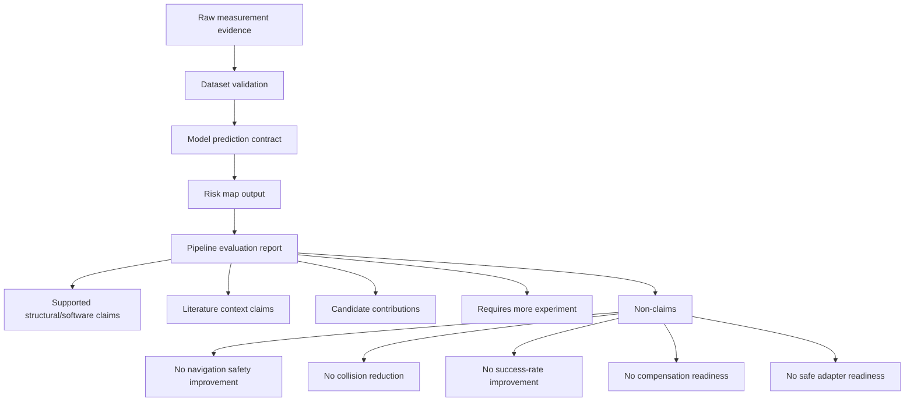

# Evidence Chain Figure Specification

## Figure title

Evidence Chain and Claim Governance

## Purpose

Show how current evidence can support structural claims while blocking unsupported performance, safety, and readiness claims.

## Intended caption

Evidence chain for the current research pipeline. Raw measurement evidence is converted to validated datasets, model prediction contracts, advisory risk maps, and pipeline evaluation reports. Claim governance separates supported structural/software claims from literature context, candidate contributions, claims requiring more experiment, and prohibited non-claims.

## Flow

- raw measurement evidence。
- dataset validation。
- model prediction contract。
- risk map output。
- pipeline evaluation report。
- claim registry。
- non-claims。

## Claim status categories

- supported structural/software claim。
- literature context claim。
- candidate contribution。
- requires more experiment。
- non-claim。

## Prohibited claims to mark explicitly

- navigation safety improvement。
- collision reduction。
- success-rate improvement。
- compensation readiness。
- safe adapter readiness。

## Mermaid diagram

