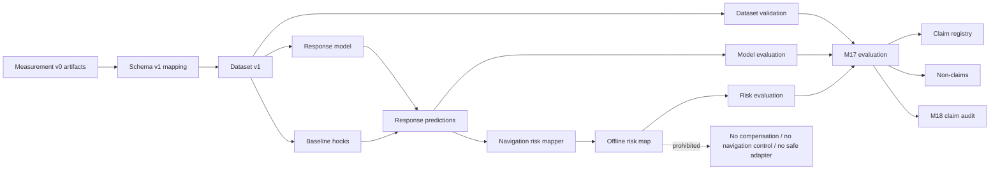

# Method Pipeline Figure Specification

## Figure title

Artifact-Governed Velocity Response Pipeline

## Purpose

Show how Measurement v0 evidence moves through schema validation, dataset construction, response modeling, risk mapping, and claim-governed evaluation without crossing into compensation or navigation control.

## Intended caption

Pipeline overview for offline K1 velocity response analysis. Measurement artifacts are converted into schema-governed dataset records, used by a conservative response model, mapped into advisory navigation-risk metadata, and audited through claim governance. The figure explicitly excludes compensation, inverse command mapping, navigation control, and safe command adapter execution.

## Nodes

- Measurement v0 artifacts。
- Schema v1。
- Dataset v1。
- Response model。
- Baseline hooks。
- Response predictions。
- Navigation risk mapper。
- Risk map。
- Evaluation / claim governance。

## Edges

- Artifact/data flow:
  - Measurement v0 artifacts -> Schema v1 mapping -> Dataset v1 -> Response model -> Response predictions -> Navigation risk mapper -> Risk map。
- Validation flow:
  - Schema v1 -> dataset validation report。
  - Response model -> model evaluation。
  - Risk mapper -> risk evaluation。
- Claim/evidence flow:
  - Dataset/model/risk outputs -> M17 evaluation -> claim registry / non-claims / M18 claim audit。

## Safety boundary markers

- no compensation。
- no inverse command mapping。
- no navigation control。
- no safe command adapter。

## Visual layout suggestion

- Left-to-right flow for method stages。
- A lower governance lane for validation reports and claim audit。
- Red boundary markers below the risk map node to show prohibited downstream execution paths。

## What should not be shown

- No robot motion command arrow。
- No controller actuation loop。
- No corrected command output。
- No closed-loop navigation planner。
- No safe command adapter block。
- No collision/success-rate metric block as available evidence。

## Data paths to cite in the figure

- `configs/velocity_response_dataset_schema_v1.json`
- `outputs/research_datasets/velocity_response_dataset_v1.json`
- `outputs/research_models/response_model_predictions_v1.json`
- `outputs/research_risk/navigation_risk_map_v1.json`
- `outputs/research_evaluation/m17_pipeline_evaluation_report.json`
- `paper/claims/m18_claim_audit.md`

## Mermaid diagram

